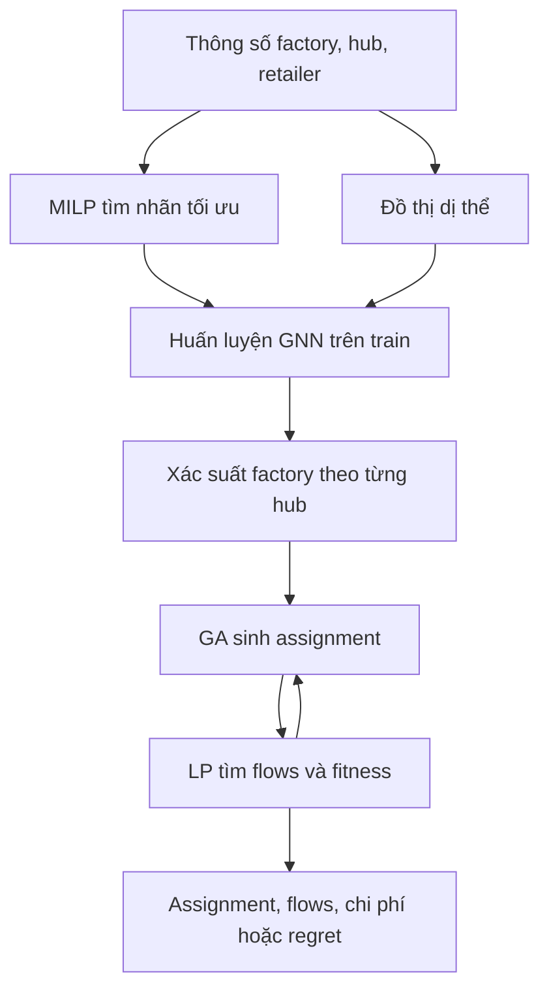

# GNN–GA–LP cho chuỗi cung ứng Physical Internet

**Đã triển khai phương pháp và chạy trên dữ liệu dựng lại; chưa tái tạo bảng kết quả gốc.** Đọc [đối chiếu và thông tin còn thiếu](REPRODUCIBILITY.md) trước khi diễn giải kết quả.

## Chạy

Từ thư mục gốc `gnn`, Python 3.10+:

```bash
python -m pip install -r supply_chain/requirements.txt
OMP_NUM_THREADS=1 MKL_NUM_THREADS=1 python -m unittest discover -s supply_chain/tests -v
OMP_NUM_THREADS=1 MKL_NUM_THREADS=1 python -m supply_chain.experiment
```

PowerShell: đặt `$env:OMP_NUM_THREADS="1"` và `$env:MKL_NUM_THREADS="1"` trước các lệnh Python. Chương trình tự đặt PyTorch/HiGHS một thread. CPU là đủ cho bộ fixture này. Không cần tải dataset bên ngoài khi chạy generator.

Chạy nhanh: `python -m supply_chain.experiment --seeds 2 --epochs 30 --no-sensitivity --output outputs/supply-chain-quick`.

Chạy mặc định: 9 fixture train, 3 validation, 3 test; tối đa 100 epoch; 20 seed ghép cặp 1001–1020; SA, GA, GNN–GA, initialization-only, entropy-only, cost warm start; deterministic và min–max regret. Thêm sensitivity B=400 với GA/GNN–GA và 10 seed trên test đầu tiên. Dữ liệu được lưu trước khi train. File kết quả được ghi sau mỗi nhóm thí nghiệm.

[Notebook Colab](https://colab.research.google.com/github/dungTudonghoa/gnn/blob/main/supply_chain/walkthrough.ipynb) đọc dữ liệu và model đã chạy, đi từ input đến xác suất, assignment và flows. [Báo cáo lần chạy](results/reconstruction/REPORT.md).

## Luồng dữ liệu



- Chromosome `[2,0,1]`: hub 0 nhận từ factory 2, hub 1 từ factory 0, hub 2 từ factory 1. Chỉ số bắt đầu từ 0.
- GNN trả `p[factory,hub]`, tổng mỗi cột bằng 1. Nhãn train là một factory tối ưu cho mỗi hub; không phải ma trận shipment.
- LP quyết định QF (factory→hub), QH (hub→hub), QR (hub→retailer), U (thiếu hàng).
- Fitness deterministic là tổng chi phí tối ưu của assignment; fitness regret là `min_flows max_s (cost_s - exact_scenario_optimum_s)`. Cùng một bộ flows dùng cho tất cả kịch bản.
- Số lần gọi LP cho **assignment mới** mới làm tăng ngân sách. Một run có cache riêng, không dùng cache của phương pháp khác.

## Tổ chức

| File | Nhiệm vụ |
|---|---|
| `data.py` | Schema JSON, validator, generator được công khai giả định |
| `optimization.py` | MILP exact reference; LP cố định assignment; residual, enumeration |
| `gnn.py` | Features, standardizer chỉ fit train, message passing, huấn luyện |
| `search.py` | SA, GA, GNN–GA, ba ablation, budget và cache |
| `experiment.py` | Chạy end-to-end, split, seed, thống kê, xuất dữ liệu/model |
| `tests/test_core.py` | Kiểm chứng độc lập công thức, budget, eligibility, permutation |
| `results/reconstruction/` | Input đã dùng, trọng số, run-level results, reference, môi trường |

## Đưa dữ liệu khác vào

Một instance JSON có `name` và các mảng sau:

| Khóa | Shape | Ý nghĩa |
|---|---|---|
| `capacity` | O | Công suất factory |
| `inbound`, `inventory` | H | Giới hạn hàng vào từ factory và tồn ban đầu |
| `demand`, `shortage_cost` | R | Nhu cầu và phạt thiếu |
| `supply_cost`, `fixed_cost`, `eligible` | O × H | Giá cấp hàng, phí gán, mask eligibility |
| `transfer_cost` | H × H | Giá chuyển hub có hướng, bỏ đường chéo |
| `delivery_cost` | H × R | Giá giao retailer |

Xem JSON thật trong `results/reconstruction/instances/`. Mô hình hiện dùng mọi hub–retailer và mọi hub–hub trừ self arcs; eligibility factory–hub có thể sparse. Chưa hỗ trợ loại bỏ riêng các cạnh hub–hub/hub–retailer trong schema.

Manifest chứa `provenance` và `instances`, mỗi bản ghi gồm `name`, `path` tương đối với manifest, `role` (`train`, `validation`, `test`), `budget` và `population` cho test. Không trùng tên giữa các split.

```bash
python -m supply_chain.experiment --manifest /absolute/path/manifest.json --output outputs/custom
```

Thay đổi dữ liệu phải tính lại scenario reference. Giá trị thiếu không được thay bằng số tham chiếu trong bài. Nếu MILP chưa chứng minh optimal, chương trình dừng và không tạo nhãn exact giả.
