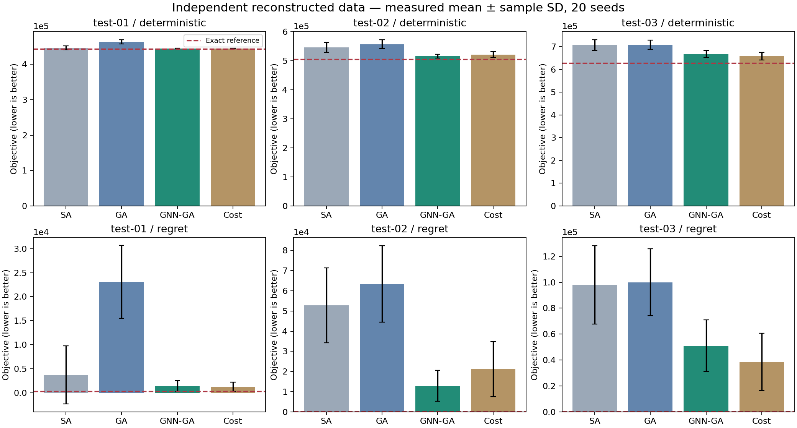

# Kết quả chạy thực tế: bản triển khai độc lập

**Các số dưới đây tính từ dữ liệu dựng lại, không phải kết quả tái tạo Tables III–VII của tác giả.**

Đã chạy 760 lượt tìm kiếm, tổng 42,400 LP cho assignment mới. Các lượt tight-budget dùng 20 seed; sensitivity dùng 10 seed. Reference được giải bằng MILP đến optimal.

GNN: chọn epoch 15, validation accuracy 66.67%; train 40 epoch trước khi dừng, thời gian train 2.13 giây. Accuracy này đo trên ba fixture validation tự dựng, không so với 75.56% của bài như cùng một test.

| Fixture | Bài toán | Budget | Exact reference | SA mean ± SD | GA mean ± SD | GNN–GA mean ± SD |
|---|---|---:|---:|---:|---:|---:|
| reconstructed-test-01 | deterministic | 75 | 443,583.37 | 446,872.99 ± 5,489.86 | 463,042.34 ± 6,151.91 | 444,627.63 ± 1,015.78 |
| reconstructed-test-01 | deterministic | 400 | 443,583.37 | — | 448,298.50 ± 3,676.50 | 443,583.37 ± 0.00 |
| reconstructed-test-01 | regret | 75 | 250.19 | 3,715.12 ± 6,055.23 | 23,090.34 ± 7,610.37 | 1,383.15 ± 1,161.62 |
| reconstructed-test-01 | regret | 400 | 250.19 | — | 4,470.27 ± 4,382.96 | 368.26 ± 373.36 |
| reconstructed-test-02 | deterministic | 25 | 505,042.44 | 546,279.88 ± 17,001.05 | 557,237.79 ± 15,262.05 | 515,561.85 ± 6,400.31 |
| reconstructed-test-02 | regret | 25 | 97.32 | 52,733.06 ± 18,576.68 | 63,441.26 ± 18,916.05 | 12,848.95 ± 7,681.09 |
| reconstructed-test-03 | deterministic | 10 | 627,488.70 | 707,015.67 ± 23,174.38 | 708,591.34 ± 19,744.27 | 668,507.57 ± 14,938.75 |
| reconstructed-test-03 | regret | 10 | 282.30 | 98,006.19 ± 30,210.96 | 99,991.00 ± 25,862.75 | 51,059.17 ± 19,954.65 |

## Diễn giải trong phạm vi lần chạy

- Tight budgets 75/25/10 nhỏ hơn population 100: GA/GNN–GA chỉ khởi tạo, không có thế hệ con hoàn chỉnh.
- Sensitivity B=400 trên fixture test-01 chạy ba thế hệ hoàn chỉnh và một thế hệ dở dang. Đây không phải Instance 13 của bài.
- `initialization_only` và `gnn_ga` có cùng kết quả theo seed ở tight budget vì mutation chưa được dùng.
- Có tổng 664 lần dùng chính sách tìm chromosome chưa thấy sau nhiều duplicate; chính sách này được công khai trong REPRODUCIBILITY.md.
- Số liệu cho thấy lợi ích trên các fixture này; không đủ để xác nhận các tỷ lệ tốc độ, p-value hay mức cải thiện của dữ liệu gốc.

## Tệp kiểm toán

- `manifest.json`, `instances/`: toàn bộ dữ liệu đầu vào và split.
- `model.pt`, `training.json`, `labels.json`: checkpoint, normalizer, lịch sử train và nhãn tối ưu.
- `references.json`: optimum theo scenario, nominal/regret và assignment.
- `runs.json`: objective, assignment, seed, budget, số LP, số thế hệ, fallback và thời gian từng run.
- `statistics.json`, `summary.csv`: mean, sample SD, success count, deviation/gap và thống kê ghép cặp.
- `environment.json`: phiên bản runtime và SHA-256 từng instance.

## Môi trường

Python 3.12.13, PyTorch 2.14.0+cu130, NumPy 2.3.5, SciPy 1.17.0; CPU, một thread.

Nguồn phương pháp: [arXiv:2608.10245v1](https://arxiv.org/abs/2608.10245). Mức độ khớp và lựa chọn chưa được tác giả công bố: [REPRODUCIBILITY.md](../../REPRODUCIBILITY.md).
